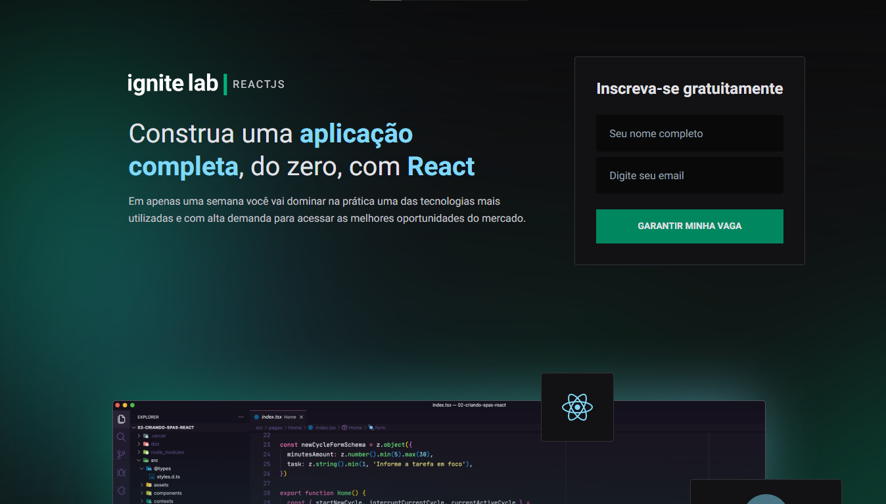
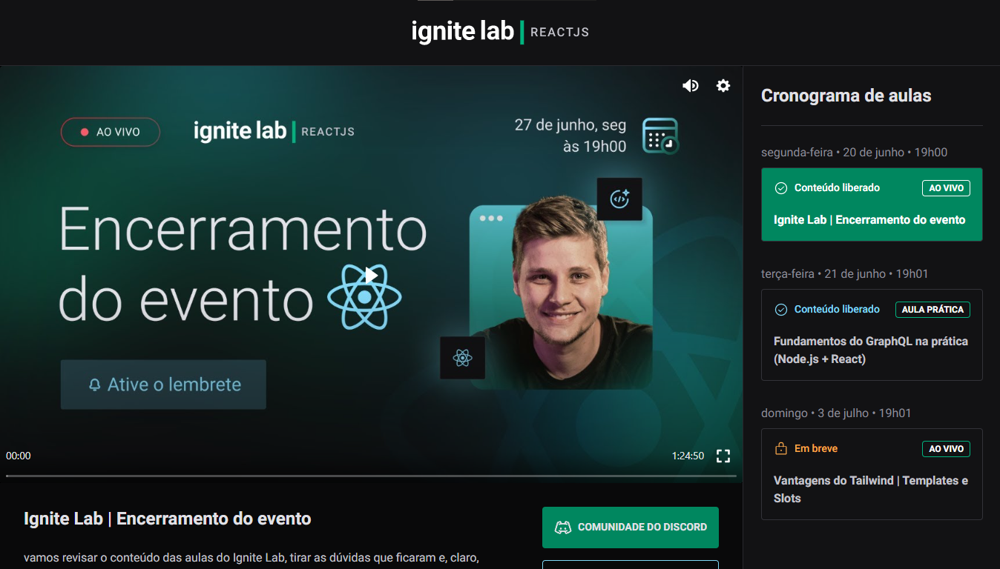
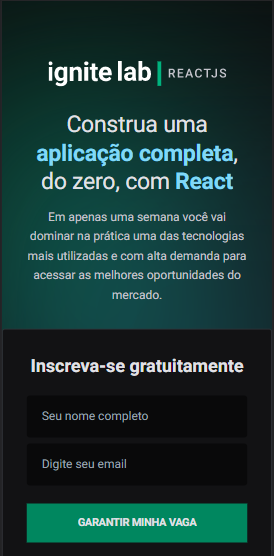
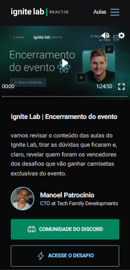

## LICENSE!

[](https://github.com/ManoelPatrocinio/expense_tracker/edit/mainLICENSE)

## 💻 Sobre o projeto

Plataforma de eventos, desenvolvida durante a Ignite Lab - Semana de especialização em React da Rocketseat.


[Confira o projeto](https://event-platform-five-sooty.vercel.app/) 


## TECNOLOGIAS USADAS


    React Js
    TypeScript
    Tailwing
    Vite
    Vime JS
    Apollo
    Graphql
      

Layout

## 🎨 Layout

</br>
O layout da aplicação está disponível no Figma:

<a href="https://www.figma.com/file/4GgkN4lk7BmVAVP5u8L1qX/Plataforma-de-evento---Ignite-Lab-(Community)?node-id=35%3A82">
  
</a>


### Web

<p align="center" style="display: flex; align-items: flex-start; justify-content: space-between;">


</p>

### Mobile

<p align="center"  style="display: flex; align-items: flex-start; justify-content: start;">
 
 
</p>

### Pré-requisitos

Antes de começar, você vai precisar ter instalado em sua máquina as seguintes ferramentas:
[Git](https://git-scm.com), e, Além disto, é bom ter um editor para trabalhar com o código como [VSCode](https://code.visualstudio.com/)

### 🎲 Rodando o Projeto

```bash
# Clone este repositório
$ git clone <https://github.com/ManoelPatrocinio/event_Platform>

# Acesse a pasta do projeto no terminal/cmd
$ cd ecatalogo

# Instale as dependências iniciais
$ npm install


# Execute a aplicação
$ yarn dev

# O servidor inciará na porta:3000 - acesse <http://localhost:3000>


```

### Autor

Feito por Rocketseat & Manoel Patrocinio 👋🏽 Entre em contato!

[](https://www.instagram.com/patrocinioiii/) [](https://linkedin.com/in/manoel-patrocinio-1b342b203)
[](mailto:manoelpatrocinio99@gmail.com)
